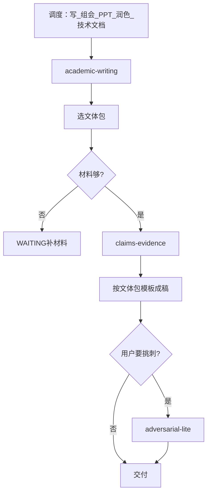

# F5 设计提纲 · 扩大版

> **状态：** 技能已落地（核心骨架）；第二批文体待补强。目录：`skills/academic-writing/`、`skills/adversarial-lite/`；夹具：`examples/f5-sample-writeup/`。  
> **背景：** 旧基本版把 F5 收窄为组会薄写作层；扩大版定位为**写作中枢**（组会稿、PPT、论文节改写、润色、技术文档等）。

---

## 一句话目标

**F5 是基于可核对材料的学术写作中枢**：用户说「写 / 组会 / PPT / 润色 / 技术文档」时进入 F5，选定**文体包**后先写主张—证据表，再成稿。无材料不编造；不代替 F2/F4。

---

## 与基本版差异

| 维度 | 基本版（旧） | 扩大版（已定） |
|------|--------------|----------------|
| 定位 | F4 下游薄写作 | 全仓库写作出口 |
| 文体 | 一页纸、问答、阶段说明 | + 汇报稿、PPT、论文节**改写**、润色、技术文档 |
| 技能形态 | `academic-writing` + `meeting-brief` 并列 | **只保留一个写作技能** `academic-writing`（多文体包）+ 可选 `adversarial-lite`；`meeting-brief` **不再作为独立工作流**（见下） |
| 协议交付名 | 冻结 4 项 | 核心 4 项不动；拟新增进协议「§3 拟新增」节，落地前再合并冻结 |

---

## 技能怎么拆（已定：更清晰的方案）

旧方案「中枢只路由、组会一律进 `meeting-brief`」容易让人和 Agent 搞不清：到底调哪个 skill、模板放哪、会不会两套分叉。

**已定方案（对齐 F2 `survey-writer` 的「一体多包」）：**

| 技能 | 角色 |
|------|------|
| `academic-writing` | **唯一** F5 写作工作流：选文体包 → 主张—证据 → 成稿 |
| `adversarial-lite` | 可选内部技能：成稿后挑刺；**标准档默认不跑** |
| ~~`meeting-brief`~~ | **不单独落地为工作流技能**。目录表可删或改成「历史别名：组会话术仍路由到 F5/`academic-writing`」 |

**文体包（都在 `academic-writing/references/`）：**

| 文体包 id（英文） | 用户话术举例 | 主交付（文件名一律 ASCII） |
|-------------------|--------------|----------------------------|
| `meeting-one-pager` | 组会一页纸 | `meeting-one-pager.md` |
| `meeting-qna` | 预期问答 | `qna-prep.md` |
| `meeting-talk` | 口播 / 汇报稿 | `meeting-talk.md` |
| `meeting-slides` | 组会 PPT | 有 LaTeX → `meeting-slides.tex`；否则仅 `meeting-slides-outline.md` |
| `stage-writeup` | 阶段技术说明 | `stage-writeup.md` |
| `tech-doc` | 技术文档 / README 类 | `tech-doc.md`（或用户指定的 **ASCII** basename） |
| `paper-section` | 论文某一节 | `paper-section-<slug>.md`（slug 如 `method`、`related-work`） |
| `polish` | 按某刊润色 | `polish-<slug>.md`（slug 如 `ieee-access`、`user-draft`） |

对人 / 对 Agent 的记法只有一句：**「进 F5 = 打开 academic-writing，选一个文体包。」**

---

## 文件名规则（已定）

- **交付文件名、slug、目录名：只用 ASCII**（英文小写、数字、连字符），避免 Windows/LaTeX/脚本路径问题。  
- **文件正文可以中文**（UTF-8）。  
- 禁止：`paper-section-方法.md`、`polish-某期刊.md` 这类中文文件名。  
- 用户口头说的中文题目写进正文或 `scope.md`，不要写进路径。

---

## 能写哪些文体（分期）

| 文体包 | 交付文件 | 本批 |
|--------|----------|------|
| （强制步骤） | `_work/claims-evidence.md` | **核心** |
| `meeting-one-pager` | `meeting-one-pager.md` | **核心** |
| `meeting-qna` | `qna-prep.md` | **核心** |
| `meeting-talk` | `meeting-talk.md` | **核心** |
| `stage-writeup` | `stage-writeup.md` | **核心** |
| `meeting-slides` | `meeting-slides-outline.md` / `meeting-slides.tex` | 第二批 |
| `paper-section` | `paper-section-<slug>.md` | 第二批 |
| `polish` | `polish-<slug>.md` | 第二批 |
| `tech-doc` | `tech-doc.md` | 第二批 |

---

## 主张—证据与诚信

1. 任何成稿前必须有 `_work/claims-evidence.md`。  
2. 每条关键主张挂证据路径或显式缺口。  
3. 强制引用 `shared/honesty-checklist.md`。  

**真底线：** 无材料不编造；不保证过审/相机就绪；未授权不扫盘；不绕付费墙；推断须标明。

**挑刺：** 标准档**不默认**开启；用户说「预演导师追问」等再调 `adversarial-lite`。

---

## PPT / LaTeX（已定）

- 无 LaTeX：**只**交 `meeting-slides-outline.md`。  
- 有 Beamer：再交 `meeting-slides.tex`；pdf 编译可选。  
- 图表不得编造数据。

---

## 与 F2 / F4 的边界（已定）

| F5 不做 | 交给 |
|---------|------|
| 检索、全景、引用核对、长综述/Related Work **从零写** | F2（含 `survey-writer`） |
| 单篇深读 | F3 |
| 扫代码日志写阶段报告 | F4 |

**论文某节 / Related Work：**

- **禁止**在 F5 从零撰写 Related Work 或长综述。  
- 须先有 F2 产物（如 `related-work.md` / `survey.md`）或用户提供的 ASCII 路径底稿。  
- F5 `paper-section` / `polish` 只做：改写、压缩、按用户大纲填空、体例润色。  
- 若用户只要「从零 Related Work」→ 调度应进 F2 `survey-writer`，不是 F5。

**推荐链路：** F2/F4 备好材料 → F5 选文体包 → 主张—证据 → 成稿 →（可选）挑刺。

---

## 协议交付名（已定）

**冻结保留：** `_work/claims-evidence.md`、`meeting-one-pager.md`、`qna-prep.md`、`stage-writeup.md`。

**拟新增（写入协议「§3 拟新增 · F5 扩大版」，落地技能前再合并进冻结表）：**

- `meeting-talk.md`
- `meeting-slides.tex` / `meeting-slides-outline.md`
- `paper-section-<slug>.md`
- `polish-<slug>.md`
- `tech-doc.md`

---

## 分期

### 核心（首版）

1. 路由进 F5 → `academic-writing`  
2. 文体包：一页纸、问答、口播、阶段说明 + 强制主张—证据  
3. 读 F4 四文件与/或 `references.json`  
4. WAITING 停车与诚信清单  

### 第二批

1. PPT 大纲 / Beamer  
2. `paper-section` / `polish` / `tech-doc`（遵守「禁止从零 Related Work」）  
3. `adversarial-lite`  
4. 可选 LaTeX 编译脚本  

---

## 审批记录（2026-07-18）

| # | 问题 | 结论 |
|---|------|------|
| 1 | 文件名 | **交付路径/文件名只用 ASCII**；正文可用中文 |
| 2 | 协议交付名 | **是**：核心四项不动；拟新增进「§3 拟新增」节，后再合并冻结 |
| 3 | meeting-brief vs academic-writing | **改方案**：取消独立 `meeting-brief` 工作流；**一体多文体包**的 `academic-writing` + 可选 `adversarial-lite` |
| 4 | 挑刺默认 | **可以**（标准档不默认开） |
| 5 | Related Work 从零 | **禁止从零**；须 F2/`survey-writer` 或用户底稿；F5 只改写/压缩/填空 |

**已授权落地（2026-07-18）：** 按本文实现 `academic-writing`（核心文体包 + 第二批薄模板）与可选 `adversarial-lite`；`meeting-brief` 不单独建目录。

---

## 关联文档

| 文件 | 关系 |
|------|------|
| `融合设计方案.md` | 基本版描述；扩大版以本文为准 |
| `AGENTS.md` | 冷启动路由 |
| `docs/接口与协议.md` | 交付名冻结 + 拟新增备注 |
| `SKILLS_CATALOG.md` | 技能看板（`meeting-brief` 行待落地时改为别名/取消） |
| `shared/honesty-checklist.md` | 成稿前强制引用 |
| `shared/workspace-layout.md` | 工作区路径 |
